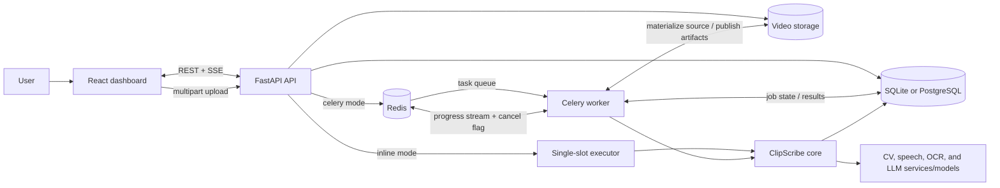
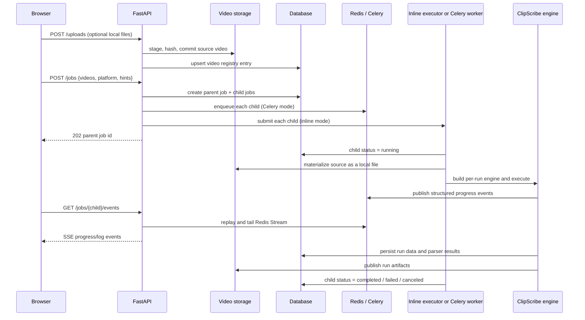
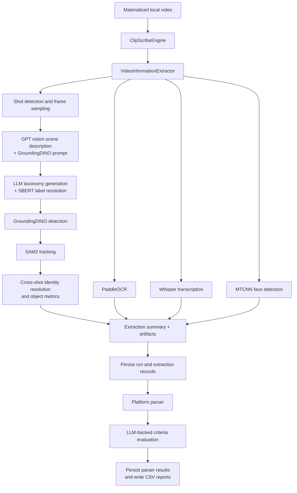
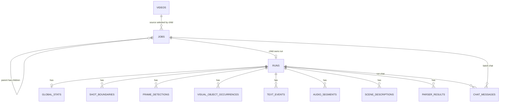

# ClipScribe System Architecture

This is the implementation-grounded architecture reference for ClipScribe as
of 2026-07-24. It documents the system that exists in this repository. It is
deliberately separate from the proposed production topology in
[deployment.md](deployment.md) and the delivery history in
[web-app-plan.md](web-app-plan.md).

## 1. Purpose and scope

ClipScribe accepts one or more videos, runs a multimodal extraction and
platform-evaluation pipeline for each video, persists the resulting structured
data, and presents live and completed results in a web dashboard.

The primary user-facing unit is a **batch job**. A submitted batch creates one
parent `job` plus one child job and one `run_id` per video. A child job is the
unit that is actually executed. A **run** is the durable record of extraction
and parser output for one video.



`Storage` is local disk by default and can be Google Cloud Storage (GCS).
`Redis` is required for Celery execution and live progress; it is also used for
cooperative cancellation. In inline mode, the pipeline remains runnable if
Redis is unavailable, but live progress and running-job cancellation degrade
gracefully.

## 2. Major components

| Component | Implementation | Responsibility |
| --- | --- | --- |
| Web dashboard | `frontend/` | Job list and creation, live child-job progress, run inspection, report export, and advisory chat. |
| API | `backend/app/` | Validates HTTP requests, uploads and lists videos, creates batch/child jobs, serves run data and media, provides SSE endpoints, and dispatches work. |
| Job execution | `app/job_execution.py`, `app/job_runner.py` | Gives inline and Celery execution one common lifecycle: mark running, materialize input, build an engine, execute, then mark terminal state. |
| Worker | `app/tasks.py`, `app/celery_app.py` | In Celery mode, owns the long-lived model-loaded `ClipScribeBuilder` and processes queued child jobs. |
| Core orchestration | `src/clip_scribe/` | Builds durable dependencies, assembles a fresh engine per run, and coordinates extraction, persistence, parsing, artifact upload, and pipeline events. |
| Extraction | `src/extractor/`, `src/ocr/` | Finds shots; analyzes scenes; generates/resolves taxonomies; detects, tracks, and re-identifies objects; extracts OCR, speech, and faces; calculates video metrics. |
| Parser | `src/parser/` | Evaluates persisted run data against platform criteria, writes reports, and persists per-criterion results. YouTube is the currently implemented platform. |
| Persistence | `src/db/`, `backend/alembic/` | SQLAlchemy reader/writer layer and Alembic-owned relational schema. |
| Storage | `src/utils/clip_scribe_video_storage.py`, `clip_scribe_artifacts.py` | Stores uploaded sources and per-run artifacts behind local/GCS abstractions. |

## 3. Web application boundary

The browser is a Vite-built React/TypeScript single-page application using
TanStack Router for routes and TanStack Query for cached server state. The
frontend uses generated OpenAPI types for most REST calls. The following
pages are implemented:

- `/` — paginated batch-job list with status filtering and lifecycle actions.
- `/jobs/new` — selects stored videos or queues local files for upload, then
  submits shared platform parameters and hints as one batch.
- `/jobs/:jobId` — batch summary or a live, per-child job view driven by SSE.
- `/runs/:runId` — inspector with original/tracked video, detection overlays,
  shot and audio timelines, extraction data, parser results, exports, and
  run-scoped advisory chat.

In development, the Vite server proxies `/api/*` to FastAPI. In the container
setup, nginx serves the SPA and proxies the same `/api/*` prefix to the API.
That shared-origin contract means the frontend does not need deployment-specific
API URLs. nginx disables response buffering for the progress and chat streams.

## 4. Job submission, execution, and live updates



The parent job is not executed. Its user-visible status is derived from the
states of its children:

- all completed → `completed`;
- all terminal with any failure → `failed`;
- all terminal with no failure and at least one cancellation → `canceled`;
- otherwise → `queued` or `running`.

The API supports two interchangeable execution modes selected by
`CLIPSCRIBE_JOB_BACKEND`:

- `inline` is a local-development path. FastAPI creates a single-slot thread
  executor and loads the heavy builder in the API process.
- `celery` keeps FastAPI model-free. The API sends only a JSON task payload to
  Redis; a Celery worker imports the heavy pipeline and reuses its builder
  across jobs.

Both modes call `run_job_core`, so job-state transitions, progress reporting,
cancellation, source materialization, and error handling are shared.

## 5. Core processing pipeline

`ClipScribeBuilder` is the long-lived dependency owner. It reads
`src/clip_scribe/configs/clip_scribe.yaml`, constructs database access, and
loads the heavyweight model dependencies once per process. For each child job,
it builds a fresh `ClipScribeEngine`, extractor, and parser so per-run state is
not shared.



The engine emits progress phases in this order for a full web job:
`scene_detection`, `audio`, `shot_processing`, `finalize`, and `parse`.
It passes a progress reporter and cancellation token into the extractor and
parser without making core modules depend on FastAPI or Redis. The worker checks
for cancellation at safe boundaries, rather than force-killing a model process.

Model/service boundaries in the current implementation are:

- OpenAI vision analyzes sampled shot frames and provides object prompts.
- LLM agents generate optional filename hints and per-shot canonical taxonomy
  candidates.
- GroundingDINO detects prompted objects; SAM2 tracks detections through shots.
- SBERT maps raw labels into the active taxonomy.
- Whisper produces speech segments; PaddleOCR records on-screen text; MTCNN
  contributes face detections; DINOv2 embeddings support identity handling.
- The parser's LangChain/LangGraph evaluator reads persisted run data and
  evaluates platform criteria. It does not re-run video extraction.

## 6. Data, artifacts, and ownership



The conceptual database ownership is as follows:

- `videos` is the deduplicated, user-scoped input registry. It keeps a source
  name, content hash, storage key, and size. The API currently uses a local
  user identity until authentication is introduced.
- `jobs` tracks orchestration state, original request parameters, execution
  metadata, and the parent/child batch hierarchy.
- `runs` is the durable record for a processed video. A run stores its own
  snapshot of the video name and durable source-storage key.
- Extraction data is normalized into global stats, shots, raw frame detections,
  objects, OCR text, audio segments, and scene descriptions.
- `parser_results` holds the persisted platform-criterion verdicts used by the
  inspector and exports.
- `chat_messages` holds only the advisory conversation. The advisor obtains
  evidence through server-side, read-only queries over run or job data.

Alembic migrations own schema creation and upgrades. The application does not
call `metadata.create_all` at runtime.

Source video and artifact bytes are not database blobs:

- With `CLIPSCRIBE_STORAGE_BACKEND=local`, sources live under `backend/input/`
  and run artifacts under `backend/artifacts/<run_id>/`.
- With `CLIPSCRIBE_STORAGE_BACKEND=gcs`, uploaded sources use a `videos/`
  prefix and are downloaded to worker scratch space just before processing.
  `tracked_output.mp4` is stored separately for playback; the remaining debug
  artifacts are archived as `artifacts.tar.gz` under `artifacts/<run_id>/`.
- The API serves local media with range-aware file responses. For GCS, it
  redirects the browser to short-lived signed URLs, leaving video delivery out
  of the API data path.

## 7. Read paths and advisory chat

After a run is complete, the frontend reads typed API resources rather than
artifact files for its interactive views. It retrieves run metadata, global
statistics and shot boundaries, visual-object occurrences, OCR, audio,
scene descriptions, parser results, and a time-windowed slice of raw frame
detections for the video overlay. Original and tracked videos are the two media
files directly consumed by the inspector.

Advisory chat is a separate server-side, streaming path:

1. The browser sends a message to a run-scoped or job-scoped chat endpoint.
2. FastAPI creates a read-only agent scoped to that run or to the completed
   runs in that batch.
3. The agent queries persisted evidence through tools, streams tokens and tool
   notifications as SSE, and stores the conversation transcript.

The chat agent is advisory only; it does not mutate runs, parser results, or
job state.

## 8. Runtime configuration and current boundaries

Configuration is split by concern:

- `clip_scribe.yaml` configures core model/extractor/parser behavior and
  project-relative paths.
- Environment variables choose execution mode, device, DB backend and pool
  sizing, Redis, storage backend, CORS, and cloud credentials.
- `CLIPSCRIBE_DB_BACKEND` chooses SQLite (default) or PostgreSQL.
- `CLIPSCRIBE_DB_POOL_SIZE` and `CLIPSCRIBE_DB_MAX_OVERFLOW` tune PostgreSQL
  connection pooling; SQLite ignores them.
- `CLIPSCRIBE_STORAGE_BACKEND` chooses local files (default) or GCS for both
  source videos and run artifacts.

The code intentionally preserves these dependency directions:

```text
frontend → FastAPI app → job execution → ClipScribe core → DB / storage / models
                              ↓
                         Redis + Celery (web delivery concern)
```

Core modules depend on small interfaces for progress, cancellation, video
storage, and artifact upload. They do not import the FastAPI application. This
keeps the CLI/batch entry point (`backend/main.py`) usable without the web app
and allows the same pipeline to run in inline or Celery mode.

## 9. Related documents

- [SSE progress flow](sse-progress-flow.md) — event vocabulary and stream
  behavior in greater detail.
- [Extractor core algorithm](extractor-core-algorithm.md) — lower-level
  extraction behavior and metrics.
- [SAM2 tracking and identity](sam2-tracking-and-identity.md) — tracking and
  identity-specific design notes.
- [Web app plan](web-app-plan.md) — implementation history and future web-app
  work; not the authority for current architecture.
- [Deployment design](deployment.md) — proposed cloud/Kubernetes topology and
  decisions; not the authority for the currently deployed environment.

## 10. Source map

Use these files as the starting points when the architecture changes:

| Concern | Primary source |
| --- | --- |
| Application composition and lifecycle | `backend/app/main.py` |
| HTTP routes and API schemas | `backend/app/routes/`, `backend/app/models.py` |
| Dispatch and job lifecycle | `backend/app/job_runner.py`, `backend/app/job_execution.py` |
| Redis events and cancellation | `backend/app/events.py` |
| Worker ownership | `backend/app/celery_app.py`, `backend/app/tasks.py` |
| Core assembly and run orchestration | `backend/src/clip_scribe/build_clip_scribe.py`, `engine.py` |
| Extraction and parser | `backend/src/extractor/extractor_core.py`, `backend/src/parser/parser_core.py` |
| Persistence | `backend/src/db/schema.py`, `reader.py`, `writer.py`, `backend/alembic/` |
| Source/artifact storage | `backend/src/utils/clip_scribe_video_storage.py`, `clip_scribe_artifacts.py` |
| Web dashboard | `frontend/src/routes/`, `frontend/src/api/`, `frontend/src/components/` |
